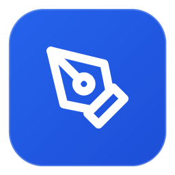

# 🖊️ BetterNote Pro Studio (Surface PC Edition)

<div align="center">



**แอปพลิเคชันจดบันทึก วาดเขียน และอ่าน/เขียนทับ PDF ประสิทธิภาพสูง สำหรับ Windows PC และ Surface Stylus**
*Ultra-Responsive, Zero-Lag, Offline-First Digital Inking & PDF Annotation Studio*

[](https://www.electronjs.org/)
[](https://reactjs.org/)
[](https://vitejs.dev/)
[](https://www.microsoft.com/surface)
[-2ea44f?style=for-the-badge&logo=windows&logoColor=white)](https://github.com/NoteGuys/BetterNotePC/releases/download/v1.0.0/BetterNotePC-v1.0.0-Windows-x64.zip)
[](https://github.com/NoteGuys/BetterNotePC/releases/latest)

</div>

---

## 🚀 ดาวน์โหลดโปรแกรมเปิดใช้งานได้ทันที (Download & Run)

สำหรับผู้ใช้งาน Windows 10 / Windows 11 สามารถดาวน์โหลดตัวโปรแกรมแบบ Standalone ไปเปิดใช้งานได้ทันทีโดยไม่ต้องติดตั้ง Node.js หรือโปรแกรมเสริม:

📦 **👉 [คลิกที่นี่เพื่อดาวน์โหลด BetterNotePC v1.0.0 (Windows 64-bit)](https://github.com/NoteGuys/BetterNotePC/releases/download/v1.0.0/BetterNotePC-v1.0.0-Windows-x64.zip)** *(ขนาด ~151 MB)*

> **💡 วิธีเปิดใช้งาน:**
> 1. ดาวน์โหลดไฟล์ `.zip` จากลิงก์ด้านบน
> 2. คลิกขวาที่ไฟล์แล้วเลือก **Extract All... (แตกไฟล์ทั้งหมด)**
> 3. ดับเบิ้ลคลิกที่ไฟล์ **`BetterNotePC.exe`** เพื่อเข้าโปรแกรมและเริ่มจดโน้ตได้ทันที!


## 🌟 จุดเด่นและวิสัยทัศน์ของ BetterNote (Overview)

**BetterNote Pro Studio** ออกแบบและพัฒนาขึ้นมาเพื่อแก้ปัญหาแอปพลิเคชันจดบันทึกบน Windows ทั่วไปที่มีความหน่วง (Latency) สูง, ลายเส้นไม่ตอบสนองต่อแรงกด, ระบบปฏิเสธฝ่ามือ (Palm Rejection) ทำงานผิดพลาด, หรือการซิงค์ไฟล์ที่ทำให้เครื่องค้าง ("Not Responding")

BetterNote มอบประสบการณ์การเขียนที่ลื่นไหลระดับ **120Hz**, ลายเส้นคมต้นคมปลายตามแรงกดปากกา, ปฏิเสธฝ่ามือได้แม่นยำ 100%, พร้อมระบบ **2-Agent Cloud & Local Backup Engine** ที่บันทึกข้อมูลและแปลงเป็นเอกสาร PDF ฉบับเต็มลงใน Google Drive และดิสก์ในเครื่องโดยอัตโนมัติ

---

## 🚀 ฟังก์ชันเด่นทั้งหมด (Comprehensive Features)

### 1. ✍️ ระบบการเขียนและลายเส้นระดับมืออาชีพ (Advanced Inking Engine)
- **Ultra-Low Latency Inking**: สถาปัตยกรรม Canvas 3 เลเยอร์ (Background Template, Static Committed Ink, Active In-Flight Stroke) ขับเคลื่อนด้วย `touch-action: none` ตอบสนองต่อปลายปากกาได้ไวระดับมิลลิวินาที
- **3 หัวปากกาเสมือนจริง (Pen Nibs)**:
  - ✒️ **ปากกาหมึกซึม (Fountain Pen)**: ให้ลายเส้นที่มีมิติ พลิ้วไหว และตอบสนองต่อแรงกดแบบคลาสสิก
  - 🖊️ **ปากกาลูกลื่น (Ballpoint Pen)**: ลายเส้นสม่ำเสมอ คมชัด เหมาะสำหรับการเขียนหนังสือและจดเลกเชอร์ยาวๆ
  - 🖌️ **พู่กันเขียนอักษร (Brush / Calligraphy)**: ตอบสนองต่อแรงกดได้กว้างเป็นพิเศษ สร้างลายเส้นหนาบางชัดเจน
- **คมต้นคมปลาย (Tapered Strokes)**: ปลายเส้นลู่เรียวอย่างเป็นธรรมชาติเมื่อจรดหรือยกปากกา
- **จำขนาดหัวแยกอิสระ (Independent Tool Widths)**: ปากกา, ไฮไลท์เตอร์, ยางลบ และรูปทรงเรขาคณิต จะจดจำขนาดหัวที่ผู้ใช้ตั้งค่าไว้แยกจากกันอย่างสมบูรณ์ ไม่สลับขนาดปนกันเมื่อเปลี่ยนเครื่องมือ
- **ไฮไลท์เตอร์สีละมุน (Smart Highlighter)**: เรนเดอร์ด้วยโหมด `multiply` ทำให้สีไฮไลท์ซึมอยู่ใต้ตัวหนังสือโดยไม่บดบังลายเส้นหรือข้อความพิมพ์

---

### 2. 🤹 ระบบท่าทางและมัลติทัชอัจฉริยะ (Smart Gestures & Multi-Touch)
- **ขยี้เส้นเพื่อลบ (Scribble-to-Erase)**:
  - ใช้ปากกาขยี้เส้นทับคำหรือลายเส้นที่เขียนผิด (ไป-กลับ-ไป 2-4 รอบ) ระบบจะลบคำนั้นทิ้งทันที
  - รองรับการขยี้ลบคำยาวและหัวข้อกว้างถึง **1,600px**
  - มีระบบ Bounding Box Density ตรวจสอบอย่างแม่นยำ ไม่ลบตัวอักษรภาษาไทย (ม, ร, น) หรือลายมือ Cursive ปกติ
  - ลบเฉพาะเส้นที่โดนขยี้ทับ โดยรักษาเส้นบรรทัดบนและบรรทัดล่างข้างเคียงไว้ครบถ้วน
- **แตะ 2 นิ้ว 2 ครั้งเพื่อย้อนกลับ (Two-Finger Double Tap Undo)**:
  - แตะ 2 นิ้ว 2 ครั้งติดกันภายใน 480ms เพื่อสั่ง Undo พร้อม Toast ยืนยัน
  - ป้องกันการเผลอ Undo จากการวางนิ้วพักบนจอหรือการแตะนิ้วเดียว
- **กางนิ้วซูมและเลื่อนอย่างนุ่มนวล (Pinch-to-Zoom & Pan)**:
  - สลับระหว่างการเขียนด้วยปากกาและการซูมด้วย 2 นิ้วได้อย่างไร้รอยต่อ
  - มีระบบ **Observer Lock** ป้องกันหน้ากระโดดขณะกำลังกางนิ้วซูม

---

### 3. 📐 ระบบวาดรูปทรงเรขาคณิตอัจฉริยะ (QuickShape Recognition)
- ลากเส้นแล้วค้างปากกาไว้เพียงเสี้ยววินาที ระบบจะปรับเส้นฟรีแฮนด์ให้กลายเป็นรูปทรงเรขาคณิตที่สมบูรณ์แบบโดยอัตโนมัติ:
  - 📏 **เส้นตรง (Straight Line)** พร้อมมุม Snap อัตโนมัติ (0°, 45°, 90°, 180°)
  - 🔺 **สามเหลี่ยม (Triangle)**: ปรับมุมตรง พร้อม Center-Scale Transform
  - ⬛ **สี่เหลี่ยม (Rectangle & Square)**
  - ⭕ **วงกลมและวงรี (Circle & Ellipse)**
  - ⬡ **รูปหลายเหลี่ยม (Polygons)**

---

### 4. 📄 การนำเข้าและเขียนทับเอกสาร PDF (PDF Import & Annotation)
- นำเข้าเอกสาร PDF หลายสิบหน้าได้อย่างรวดเร็ว ด้วย `pdfjs-dist`
- เรนเดอร์หน้ากระดาษ PDF เป็นพื้นหลังความละเอียดสูง สามารถขีดเขียน ไฮไลท์ หรือแทรกข้อความทับได้อิสระ
- **ส่งออก PDF คุณภาพสูง (Export to PDF)**: แปลงทั้งหน้ากระดาษ รูปภาพ และลายเส้นกลับเป็นไฟล์ PDF ไบนารีแท้ เปิดอ่านได้ใน Microsoft Edge, Adobe Acrobat, หรือพิมพ์ลงกระดาษได้คมชัด 100%

---

### 5. ✂️ เครื่องมือตัดแปะและจัดวางรูปภาพ (Snip & Image Tools)
- **เครื่องมือตัดภาพ (Snip / Lasso Tool)**: วงเลือกพื้นที่บนหน้ากระดาษเพื่อ Crop นำมาเป็นสติกเกอร์หรือแปะซ้ำได้ทันที
- **แทรกและปรับขนาดรูปภาพ**: ปรับย่อ-ขยาย หมุน และวางรูปภาพบนหน้ากระดาษได้อย่างอิสระ

---

### 6. 🛡️ ระบบ 2-Agent Cloud Sync & Backup Engine (ระบบสำรองข้อมูล)
- **บันทึกสำรองอัตโนมัติสู่ Google Drive และดิสก์ในเครื่อง**:
  - โฟลเดอร์สำรองหลัก: `H:\My Drive\BetterNote.AppPC`
  - โฟลเดอร์สำรองในเครื่อง: `BetterNote_Backups/`
- **บันทึก 3 รูปแบบพร้อมกัน**:
  1. `PDF_Documents/*.pdf`: เอกสาร PDF รวมหน้าและลายเส้นฉบับเต็ม เปิดอ่านได้ทันที
  2. `Editable_Notes/*.bnote`: ไฟล์โครงสร้างโน้ตแบบ Editable พร้อมกู้คืนกลับมาแก้ไขได้ตลอดเวลา
  3. `Full_System/BetterNote_Latest_Backup.json`: ไฟล์ฐานข้อมูลระบบทั้งหมดสำหรับกู้คืนกรณีติดตั้งเครื่องใหม่
- **Zero-Lag Differential Sync**:
  - บันทึกเฉพาะสมุดเล่มที่มีการแก้ไขใหม่ (`updatedAt > lastPdfBackupTime`) ไม่แปลงซ้ำซ้อน
  - มีการ Yield สลับงานรอบละ 20ms เพื่อรักษาเฟรมเรต 60-120Hz ไม่ทำให้เครื่องค้าง Not Responding
- **เปิดตำแหน่งไฟล์ตรง (Native File Reveal)**:
  - ในหน้าต่าง **"สถานะ Backup"** สามารถคลิกปุ่ม **"เปิดตำแหน่งไฟล์ ↗"** ในแต่ละแถว เพื่อให้ Windows Explorer เด้งขึ้นมาพร้อมไฮไลต์เลือกไฟล์นั้นทันที

---

### 7. 🧹 ระบบล้างแคชและคืนหน่วยความจำ (App Cache & RAM Optimization)
- จัดการแคชความจุสูง 5GB แบบ Deduplicated LRU Cache (`appCacheService`)
- มีปุ่ม **"ล้างแคชทั้งหมด"** ในหน้าต่างการตั้งค่า (Settings Modal) และหน้าต่าง Backup Status ช่วยล้างภาพพรีวิวเรนเดอร์ชั่วคราวและคืน RAM ให้ระบบทันที โดยไม่กระทบต่อข้อมูลสมุดบันทึก

---

## 🛠️ สถาปัตยกรรมเทคโนโลยี (Tech Stack)

| ส่วนประกอบ | เทคโนโลยีที่เลือกใช้ | บทบาทการทำงาน |
| :--- | :--- | :--- |
| **Desktop Framework** | [Electron 33](https://www.electronjs.org/) | รันแอปพลิเคชัน Desktop บน Windows จัดการระบบไฟล์ IPC และ Native Dialogs |
| **UI Framework** | [React 18](https://reactjs.org/) | จัดการ UI Components, Reactive State และ Lifecycle |
| **Build & Bundler** | [Vite 6](https://vitejs.dev/) | HMR รวดเร็ว และ Bundling ไบนารีระดับเสี้ยววินาที |
| **Styling** | Pure Vanilla CSS (`.bn-*`) | ดีไซน์โมเดิร์น กระจกเงา Glassmorphism ปราศจากปัญหาคลาสเพี้ยน |
| **Database** | HTML5 IndexedDB (`idb`) | จัดเก็บข้อมูลโน้ต สโตรก และเทมเพลตแบบ Offline-First ปลอดภัย 100% |
| **PDF Processing** | `pdfjs-dist` & `jspdf` | การนำเข้า Render หน้า PDF และการแปลงส่งออกเป็น PDF ไบนารีแท้ |
| **Icons** | [Lucide React](https://lucide.dev/) | ชุดไอคอนมินิมอลโมเดิร์นระดับพรีเมียม |

---

## 📂 โครงสร้างไดเรกทอรีโปรเจกต์ (Project Structure)

```text
BetterNote/
├── electron/
│   ├── main.cjs            # Electron Main Process (IPC Handlers, Window Management, File Reveal)
│   └── preload.cjs         # Context Bridge Preload API (Secure Renderer Exposure)
├── src/
│   ├── components/
│   │   ├── Common/         # Navbar, Modals, Export Dialogs
│   │   ├── Editor/         # CanvasBoard, NoteEditor, Toolbar, Sidebar, Cropper
│   │   └── Library/        # LibraryView, FolderCard, NotebookCard, BackupStatusModal
│   ├── services/
│   │   ├── appCacheService.js    # 5GB Deduplicated LRU Cache Engine
│   │   ├── autoBackupService.js  # Non-blocking Background Sync & Restore Engine
│   │   ├── db.js                 # IndexedDB Local Storage Manager
│   │   └── fileSystemService.js  # Import/Export .bnote and .json Backup Files
│   ├── utils/
│   │   ├── inkingEngine.js       # Low-Latency Stylus Rendering, Scribble-to-Erase
│   │   ├── pdfExportEngine.js    # Multi-page PDF Generator with Canvas Layers
│   │   └── shapeRecognition.js   # Geometric QuickShape Snapping Engine
│   ├── index.css                 # Pure Vanilla CSS Design System & Theme Engine
│   ├── App.jsx                   # Root Application Container
│   └── main.jsx                  # React DOM Entrypoint
├── package.json
├── vite.config.js
└── README.md
```

---

## 💻 การติดตั้งและเปิดใช้งานโปรแกรม (Getting Started)

### ความต้องการของระบบ (System Requirements)
- **ระบบปฏิบัติการ**: Windows 10 หรือ Windows 11 (64-bit)
- **อุปกรณ์แนะนำ**: หน้าจอสัมผัส และปากกาสไตลัส (Microsoft Surface Pro, Surface Laptop Studio, หรือแล็ปท็อป 2-in-1 ที่มี Windows Ink)
- **Node.js**: เวอร์ชัน 18 ขึ้นไป

### ขั้นตอนการรันเพื่อทดสอบ (Development Mode)
```bash
# 1. ติดตั้ง Dependencies ทั้งหมด
npm install

# 2. เริ่มต้นรัน Electron Desktop App
npm run electron
```

### การคอมไพล์สำหรับ Production (Production Build)
```bash
# คอมไพล์ React Bundle ผ่าน Vite
npm run build

# รันแอปพลิเคชันจากโฟลเดอร์ dist ที่คอมไพล์แล้ว
npx electron .
```

---

## ⌨️ คีย์ลัดและ Gesture ที่รองรับ (Shortcuts & Gestures)

| ท่าทาง / คีย์ลัด | คำสั่ง | การทำงาน |
| :--- | :--- | :--- |
| **แตะ 2 นิ้ว 2 ครั้งติดกัน** | Double Tap Undo | สั่งย้อนกลับการกระทำล่าสุด |
| **กาง 2 นิ้วเข้า-ออก** | Pinch-to-Zoom | ซูมขยายหรือย่อหน้ากระดาษ (25% - 400%) |
| **ลาก 2 นิ้วพร้อมกัน** | Two-Finger Pan | เลื่อนมุมมองหน้ากระดาษโดยไม่ทำให้เกิดเส้นหมึก |
| **ใช้ปากกาขยี้เส้น ไป-กลับ** | Scribble-to-Erase | ลบคำหรือข้อความที่เขียนผิดทิ้งทันที |
| **ลากเส้นแล้วค้างปากกา 0.4s** | QuickShape Hold | แปลงเส้นวาดมือเป็นรูปทรงเรขาคณิตตรง |
| `Ctrl + Z` | Undo | ย้อนกลับการเขียน |
| `Ctrl + Y` | Redo | ทำซ้ำการเขียน |
| `Ctrl + S` | Backup Now | สั่งบันทึกสำรองข้อมูลทันที |

---

## 📄 ลิขสิทธิ์และการพัฒนา (License)
โปรเจกต์นี้ได้รับการพัฒนาขึ้นเพื่อการใช้งานจดบันทึกประสิทธิภาพสูงบน Surface PC 
พัฒนาโดยทีมงาน BetterNote Studio © 2026 สงวนลิขสิทธิ์
